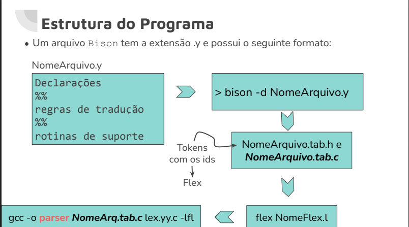

# Projeto - 3 etapa

Repositório destinado ao trabalho final da disciplina de Compiladores do curso de Ciência da Computação - UESC - 2024.2

## Descrição

Este é um compilador desenvolvido usando Flex (Lexical Analyzer) e Bison (Parser Generator) para a linguagem PreX. 

## Sobre o Bison

Bison é um gerador de analisadores sintáticos de propósito geral que converte uma descrição gramatical para um programa em C que realiza análise sintática. É compatível com Yacc (antecessor do BISON). Principais características:

- Gera parsers LALR(1) por padrão
- Suporta análise sintática ascendente (bottom-up)
- Integração perfeita com Flex para análise léxica
- Gera código em C 
- Suporta resolução de ambiguidades através de precedência e associatividade

### Resolução de Ambiguidades
O Bison oferece mecanismos para resolver ambiguidades em gramáticas através de dois conceitos principais. É importante notar que o Bison não aceita gramáticas inerentemente ambíguas - todas as ambiguidades devem ser resolvidas explicitamente através destes mecanismos, caso contrário, o Bison reportará ERROS de conflitos shift/reduce ou reduce/reduce.

#### Tipos de Conflitos
1. **Conflito Shift/Reduce**: Ocorre quando o Bison não sabe se deve continuar lendo tokens (shift) ou aplicar uma regra de produção (reduce)
2. **Conflito Reduce/Reduce**: Ocorre quando existem múltiplas regras de produção que podem ser aplicadas ao mesmo tempo

#### Precedência
Define a ordem de prioridade entre operadores. Por exemplo, em expressões matemáticas:
- Multiplicação (`*`) e divisão (`/`) têm maior precedência que adição (`+`) e subtração (`-`)
- Exemplo: `2 + 3 * 4` é interpretado como `2 + (3 * 4)`, não como `(2 + 3) * 4`

#### Associatividade
Define como operadores de mesma precedência são agrupados:
- **Associatividade à esquerda**: operações são agrupadas da esquerda para a direita
  - Exemplo: `a - b - c` é interpretado como `(a - b) - c`
- **Associatividade à direita**: operações são agrupadas da direita para a esquerda
  - Exemplo: `a = b = c` é interpretado como `a = (b = c)`

No Bison, isso é declarado usando diretivas como:
```c
%left '+' '-'    /* associatividade à esquerda para + e - */
%left '*' '/'    /* * e / têm maior precedência que + e - */
%right '='       /* associatividade à direita para atribuição */
```

#### Como o Bison Funciona:
1. **Entrada**: Recebe um arquivo com regras gramaticais (.y)
2. **Processamento**: 
   - Analisa as regras gramaticais
   - Gera tabelas de parsing
   - Resolve conflitos usando precedência e associatividade
3. **Saída**: Gera código C para o parser



## Linguagem PreX

A linguagem PreX é uma linguagem de programação simples que suporta:
- Declarações de variáveis
- Operações aritméticas
- Estruturas de controle
- Entrada e saída básica

### Estrutura Básica
Todo programa PreX deve seguir a estrutura:
```
PROGRAMA PREX {
    // declarações e comandos
}
```

### Tipos de Dados
- `FLOAT`: Números de ponto flutuante
  - Exemplo: `FLOAT nota1, nota2;`

### Declaração de Variáveis
- Variáveis devem ser declaradas antes do uso
- Múltiplas variáveis podem ser declaradas na mesma linha usando vírgula
- Toda declaração termina com ponto e vírgula
```
FLOAT nota1;
FLOAT nota2, nota3;
```

### Operações
- **Entrada/Saída**:
  - `LER`: Lê um valor do teclado
  - `ESCREVER`: Exibe um valor na tela
  
- **Operações Aritméticas**:
  - Adição (`+`)
  - Subtração (`-`)
  - Multiplicação (`*`)
  - Divisão (`/`)

### Exemplo de Programa
```
PROGRAMA PREX {
    FLOAT nota1;
    FLOAT nota2;

    LER nota1;
    ESCREVER nota1;

    nota1 = 3,14;
    nota2 = nota1 * 2;

    ESCREVER nota2;
}
```

## Estrutura do Projeto

- `tokens.l` - Arquivo Flex com as definições léxicas
- `bison.y` - Arquivo Bison com a gramática e regras sintáticas
- `programa.prex` - Exemplo de programa na linguagem PreX
- `bison.tab.c` e `bison.tab.h` - Arquivos gerados pelo Bison
- `lex.yy.c` - Arquivo gerado pelo Flex
- `parser` - Executável do compilador

## Pré-requisitos

Para compilar e executar este projeto, você precisa ter instalado:

- GCC (GNU Compiler Collection)
- Flex (Fast Lexical Analyzer)
- Bison (GNU Parser Generator)

## Como Compilar

1. Gere o analisador léxico:
```bash
flex tokens.l
```

2. Gere o parser:
```bash
bison -d bison.y
```

3. Compile o projeto:
```bash
gcc lex.yy.c bison.tab.c -o parser
```

## Como Executar

Para compilar um programa PreX:
```bash
./parser < programa.prex
```

